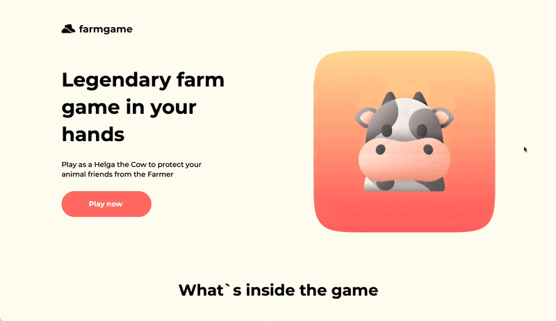
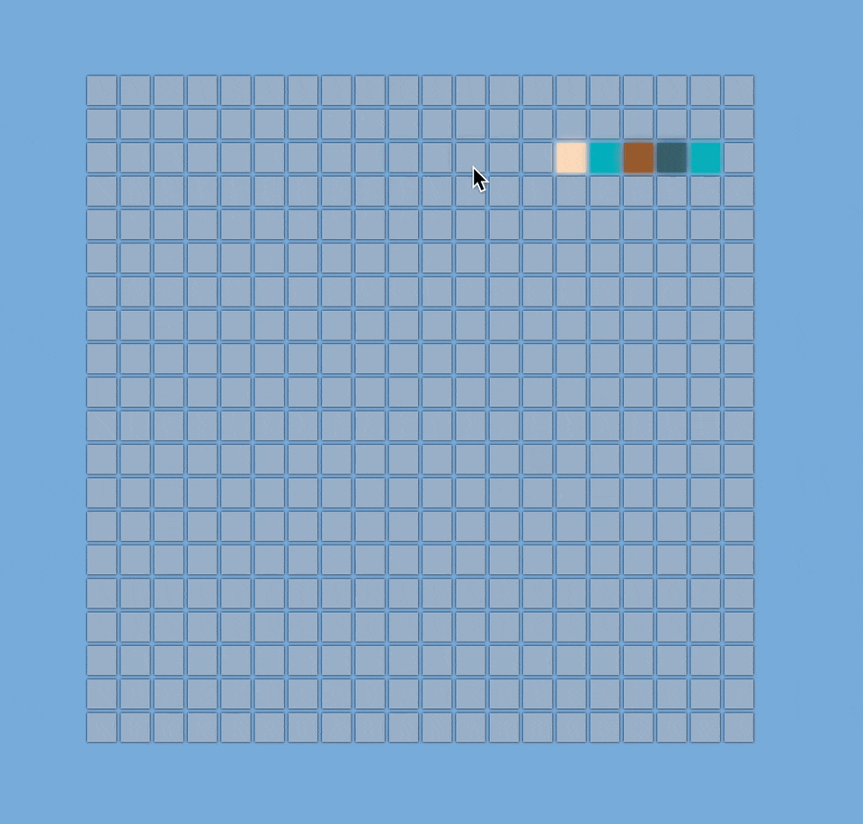
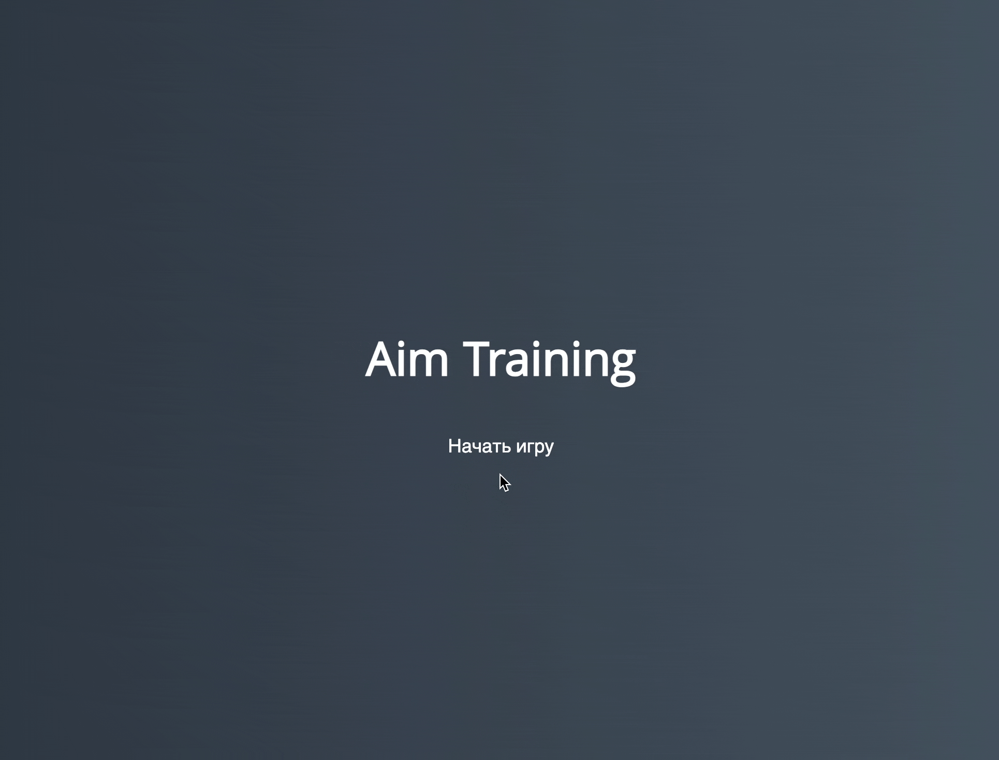
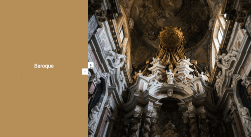
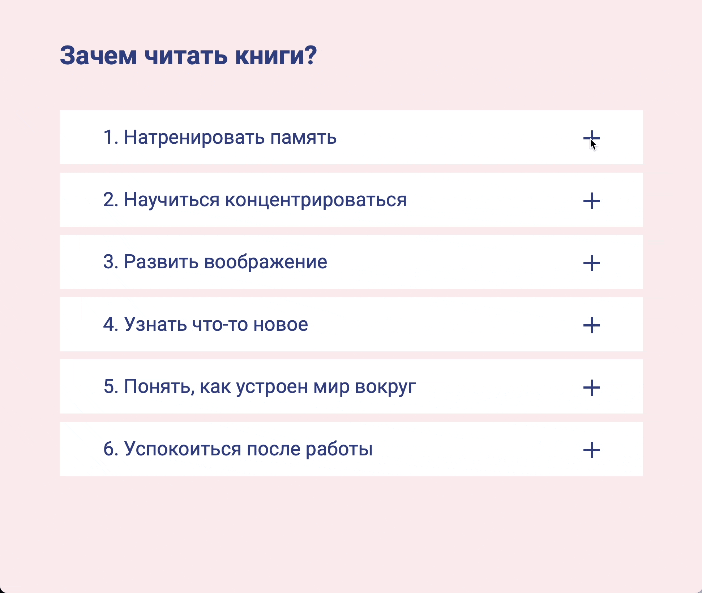
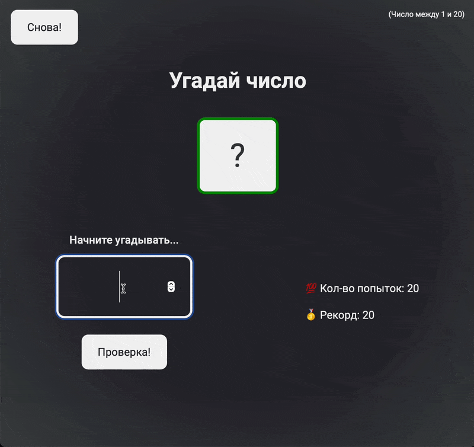
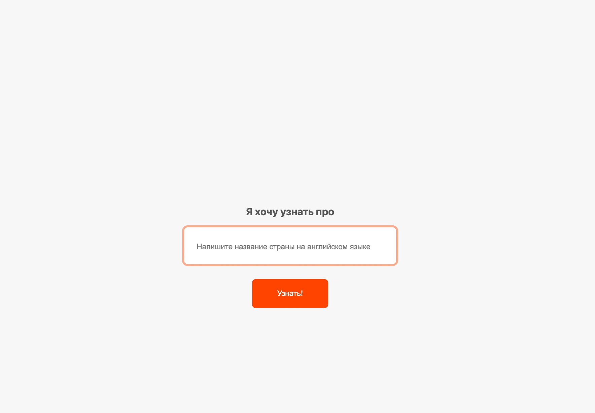

<!DOCTYPE html>
<html>
<head>
    <meta charset="UTF-8">
</head>
<body>

    <h1>Educational Projects</h1>
    

        

            

                <b>Об этом репозитории</b>
            

            <ul>
                

Репозиторий содержит проекты на основе материалов курсов/видео/марафонов, которые показались полезными для развития и отработки различных навыков в области frontend разработки.
                

            </ul>
        

  

            

                <b>About this repository</b>
            

            <ul>
                

The repository contains projects based on courses/videos/marathons materials that seemed useful for developing and practicing various skills in the field of frontend development.
                

            </ul>
        

        <h2>Contents | Содержание</h2>
        <ul>
                <h4>⬛ Project: <a href="https://github.com/ale-sanches/source-vault/tree/release/farmgame-landing/way-up-farmgame">"FarmGame" landing</a></h4>
            <ul>
                

                    
                    
                    
                    
                    
                     
                    Landing page for the game about farm animals with css animation and adaptive.  
                    Adaptive: ✅ 
                    Figma link: <a href="https://www.figma.com/file/gwCscfNXTolmwoI8zzbIkJ/Farmgame-Responsive?type=design&node-id=0-1&mode=design&t=ZcB4LhBoUaeqDDiQ-0">click</a>  
                

                    

                    
<b>Preview</b>

                    
                    

            </ul>
<h4>⬛ Project: <a href="https://github.com/ale-sanches/source-vault/tree/step-to-web-japan-lending/step-to-web-japan-lending">"Travel to Japan" landing</a></h4>
            <ul>
                

                    
                    
                    
                     
                    INFO  
                    Adaptive: ✅ 
                    Figma link: <a href="https://www.figma.com/file/0vaYHB7AAXmw5YrXQyCza5/travel-landing-page-jacobvoyles?type=design&node-id=0-1&mode=design&t=wtCaJSu2sEt8UqCj-0">click</a>  
                

                    

                    
<b>Preview</b>

                    
                    

            </ul>
 <h4>⬛ Project: <a href="https://github.com/ale-sanches/source-vault/tree/release/airpods-landing/airpods-landing">"AirPodsMax" landing</a></h4>
            <ul>
                

                    
                    
                    
                    
                    
                     
                    Landing page for AirPodsMax. JS and CSS animation for changing color of the page details and photos after click while choosing AirPods color.  
                    Adaptive: ✅ 
                    Figma link: <a href="https://www.figma.com/file/IOH3XKIpThMPclf2pHLIJr/Airpods-m?type=design&mode=design&t=ZcB4LhBoUaeqDDiQ-0">click</a>  
                

                    

                    
<b>Preview</b>

                    
                    

            </ul>
 <h4>⬛ Project: <a href="https://github.com/ale-sanches/source-vault/tree/release/color-board/color-board">Color Board</a></h4>
            <ul>
                

                    
                    
                    
                    
                     
                    Simple JS game where squares randomply colour when you hover them  
                

                    

                    
<b>Preview</b>

                    
                    

            </ul>
<h4>⬛ Project: <a href="https://github.com/ale-sanches/source-vault/tree/release/aim-training-game/aim-training-game">"Aim Training" Game</a></h4>
            <ul>
                

                    
                    
                    
                     
                    Game based on ready styles and layout, made during the JS-marathon. Different game-time available, click on as many circles as possible!  
                

                    

                    
<b>Preview</b>

                    
                    

            </ul>
<h4>⬛ Project: <a href="https://github.com/ale-sanches/source-vault/tree/release/slider-art/slider-art">"Art Styles" slider</a></h4>
            <ul>
                

                    
                    
                    
                    
                     
                    Nice JS-slider. Slides change when you click on arrows.  
                

                    

                    
<b>Preview</b>

                    
                    

            </ul>
<h4>⬛ Project: <a href="https://github.com/ale-sanches/source-vault/tree/release/acordeon/accordeon">"Accordeon" component</a></h4>
            <ul>
                

                    
                    
                    
                     
                    A task from HTML-academy olympics, items open when you click on pluses  
                

                    

                    
<b>Preview</b>

                    
                    

            </ul>
<h4>⬛ Project: <a href="https://github.com/ale-sanches/source-vault/tree/release/guess-number-game/stepik-js/guess-number-game">"Guess Number" game </a></h4>
            <ul>
                

                    
                    
                    
                    
                    
                     
                    Game based on ready html-template. Task from "JS basics" course. The game create "a secret number" 
and you should guess it. The game can keep the records of the current session and count attempts.  
                

                    

                    
<b>Preview</b>

                    
                    

            </ul>
<h4>⬛ Project: <a href="https://github.com/ale-sanches/source-vault/tree/release/country-info/country-info">"Info about Countries" app</a></h4>
            <ul>
                

                    
                    
                    
                    
                     
                    Put the name of the country to get info about its capital, coat of arms, population, random neigbour country etc.  
                    API link: <a href="https://restcountries.com">click</a>  
                

                    

                    
<b>Preview</b>

                    
                    

            </ul>
        </ul>

</body>
</html>
